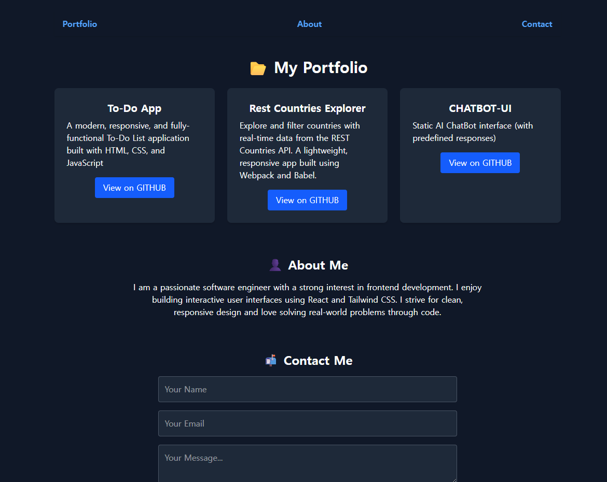

## 💼 Developer Portfolio

A modern, responsive personal portfolio built with **React**, **Tailwind CSS**, and **EmailJS**.  
Includes dark mode, contact form, blog links, and social media footer.

---

## 🌟 Features

- 🎨 Fully Dark-Themed Design (No light mode)
- 🖼️ Responsive layout with Tailwind CSS
- 📂 Portfolio Projects Section (with GitHub links)
- 👤 About Me Section
- 📬 Contact Form (EmailJS integrated)
- 🌐 Blog Links: Telegram & Naver
- 🔗 Footer with GitHub, LinkedIn, Twitter, Instagram
- 🎯 Hover effects & animations

---

## 📦 Technologies Used

- [React](https://reactjs.org/)
- [Tailwind CSS](https://tailwindcss.com/)
- [EmailJS](https://www.emailjs.com/)
- [React Icons](https://react-icons.github.io/react-icons/)
- [Vite](https://vitejs.dev/)

---

## 📁 Folder Structure

```
src/
├── assets/           # Images and animations (like Lottie)
├── components/       # Reusable components (ProjectCard, Loading)
├── App.jsx           # Main application component
├── index.css         # Tailwind base styles
└── main.jsx          # Entry point
```

---

## 🚀 Getting Started

```bash
# Clone the repository
git clone https://github.com/DevFayzullo/portfolio.git
cd portfolio

# Install dependencies
npm install

# Start the dev server
npm run dev
```

> Make sure to configure your **EmailJS** keys in `App.jsx`.

---

## 📸 Screenshots



---

## 🔧 Customization

- Update `src/data/projects.json` with your own project data.
- Replace blog and social links in `App.jsx`.
- Update "About Me" text with your personal story.

---

## 📮 Contact

For any questions, feel free to contact me via:

- Telegram: [@Fayzullo's Life](https://t.me/devFayzullo)
- Naver Blog: [줄로](https://blog.naver.com/devfayzullo)

---

## 📝 License

This project is open-source. You can use and modify it for personal or professional portfolios.

---

## 🧠 Quote

> "The only way to do great work is to love what you do."  
> — _Steve Jobs_

Happy Coding😊
