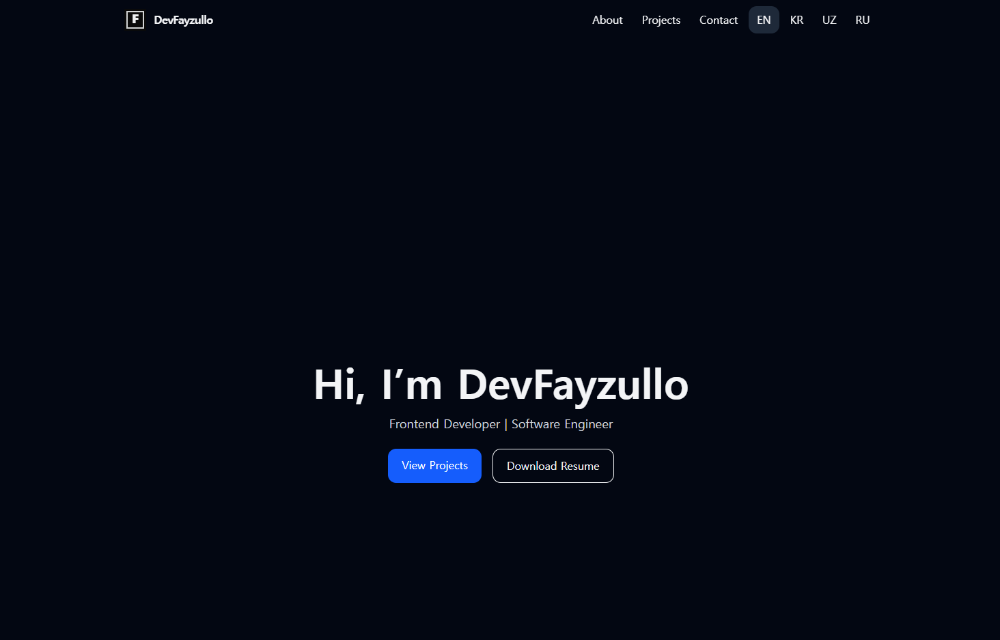

# 💼 Developer Portfolio

[🇰🇷 한국어 README](./README.kr.md)

A modern, responsive personal portfolio built with **React**, **Tailwind CSS**, and **EmailJS**.  
Includes dark mode, contact form, blog links, and social media footer.

---

## 🌟 Features

- 🎨 Fully Dark-Themed Design (No light mode)
- 🖼️ Responsive layout with Tailwind CSS
- 📂 Portfolio Projects Section (with GitHub links)
- 👤 About Me Section
- 📬 Contact Form (EmailJS integrated)
- 🌐 Blog Links: Telegram & Naver
- 🔗 Footer with GitHub, LinkedIn, Twitter, Instagram
- 🎯 Hover effects & animations

---

## 📦 Technologies Used

- [React](https://reactjs.org/)
- [Tailwind CSS](https://tailwindcss.com/)
- [EmailJS](https://www.emailjs.com/)
- [Lucide React](https://lucide.dev/) (for icons)
- [Vite](https://vitejs.dev/)

---

## 📁 Folder Structure

```
src/
├── assets/           # Images and animations (like Lottie)
├── components/       # Reusable components (ProjectCard, Loading, Footer...)
├── sections/         # Section-based components (About, Projects, Skills, Contact)
├── pages/            # Page routes (Home, About, Projects, Contact, NotFound)
├── routes/           # Router configuration
├── data/             # JSON data (projects.json)
├── App.jsx           # Main layout
├── index.css         # Tailwind base styles
└── main.jsx          # Entry point
public/
├── projects/         # Project cover images
├── resume/           # Resume files (resume.pdf, resume-kr.pdf)
└── ...
```

---

## 🚀 Getting Started

```bash
git clone https://github.com/DevFayzullo/portfolio.git
cd portfolio
npm install
npm run dev
```

---

## ⚙️ Environment Variables

```env
VITE_EMAILJS_SERVICE_ID=your_service_id
VITE_EMAILJS_TEMPLATE_ID=your_template_id
VITE_EMAILJS_PUBLIC_KEY=your_public_key
```

---

## 📸 Screenshots



---

## 🔧 Customization

- Update `src/data/projects.json` with your own project data.
- Replace blog/social links in `Footer.jsx` or `ContactSection.jsx`.
- Update "About Me" text with your personal story.
- Replace resumes in `public/resume/`.

---

## 📚 Documentation

- Development Notes (EN): [docs/notes.md](./docs/notes.md)
- 개발 메모 (KR): [docs/notes.kr.md](./docs/notes.kr.md)

---

## 📮 Contact

- Telegram: [@DevFayzullo](https://t.me/devFayzullo)
- Naver Blog: [Fayzullo’s Life](https://blog.naver.com/devfayzullo)

---

## 📝 License

This project is open-source. You can use and modify it for personal or professional portfolios.

---

## 🧠 Quote

> "The only way to do great work is to love what you do."  
> — _Steve Jobs_
